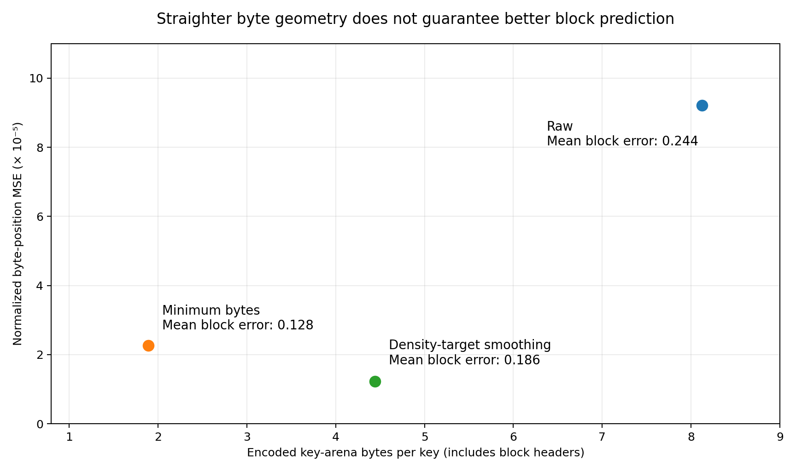
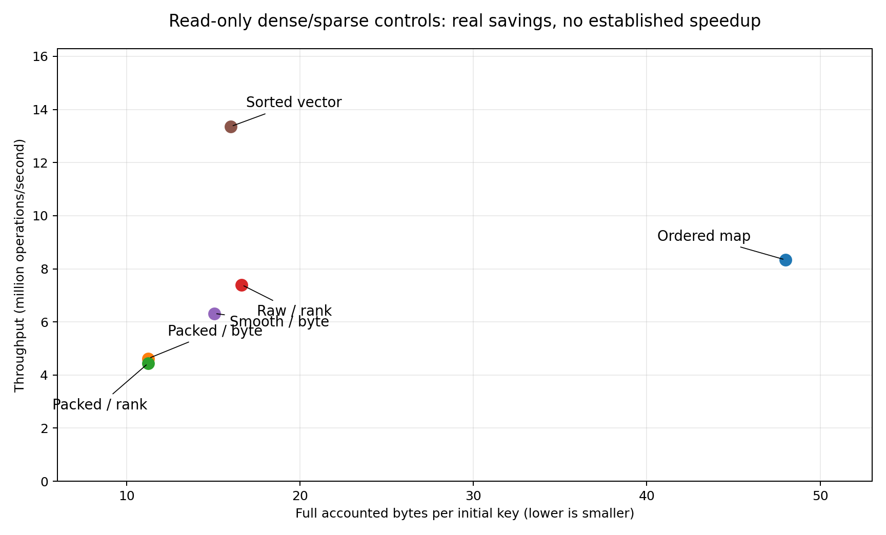

# 1. Executive decision

**Build an exact, compression-enabled ordered index whose learned prediction target can be switched between logical rank and physical encoded-key position. Treat improved performance as a hypothesis, not a consequence of compression.**

This package contains a working C++20 prototype, exact baseline implementations, synthetic and real-data ingestion tools, controlled experiments, correctness tests, and actual small-scale results. It is a research foundation: the central mechanisms run end to end, but neither production maturity nor superiority over published indexes is claimed.

The proposed research question is more precise than “does compression smooth a CDF?”:

> Under what combinations of local key geometry, codec compressibility, query locality, payload representation, and update pressure does selective physical compression reduce the total cost of an exact ordered lookup or scan, relative to the same index without compression and to strong external baselines?

The distinction matters because lossless compression changes representation length, not key order. An index that continues to predict logical rank sees exactly the same rank function after compression. A physical-byte predictor sees a different target, but must also pay to recover an actual block and decode the desired key. A reduction in byte-valued prediction error is not, by itself, evidence of a better learned index.

## 1.1 Deliverable contract

| Area | Delivered in version 0.1.0 | Deliberately outside this version |
|---|---|---|
| Core map | Exact uint64 keys and uint64 values; unique-key upserts | Multimap or SQL NULL semantics |
| Reads | Point lookup, lower_bound, ordered bounded-length range scan | Snapshot-consistent concurrent iterators |
| Updates | Single-thread inserts, replacement, deletion; local buffering and rebuild | Transactions, durability, concurrent writers |
| Compression | Actual raw, FOR, restarted delta, and integer-linear-residual blocks | SIMD-tuned production codecs or full LeCo reproduction |
| Learned search | One affine rank and byte model per region; exact fence correction | PGM-style certified approximation bounds or a learned root |
| Policy | Minimum-byte, density-target, and write-heat hysteresis controls | Calibrated end-to-end optimal policy |
| Benchmarks | Exact local baselines, paired traces, tail latency, memory, work/debt counters | Completed real-data or SOTA performance comparison |
| External integration | Source-verified dataset catalog and optional ALEX/PGM bridge | Downloaded upstream trees or compiled upstream results |

Read this document together with `README.md`, `docs/METRICS.md`, and `integrations/STATUS.md`. The code is the authority for version-0.1 behavior; proposed changes are explicitly labeled.

## 1.2 What would constitute progress

There are three different possible successes. **Compression success** means a favorable full-memory/latency trade-off even when rank prediction is unchanged. **Geometric success** means byte routing reduces useful search work relative to rank routing on the *same compressed layout*. **Joint-system success** means these improvements survive decoding, range scans, updates, and maintenance costs. Only the third supports the complete project hypothesis.

A negative result is also useful: a strong compression ratio with slower queries shows that representation savings alone do not establish smoothing value. The included experiments already expose this distinction.

# 2. What the papers establish—and what they do not

The two attachments are the requested conceptual basis. The expanded literature review then adds compression and robustness work that is essential to avoiding an outdated or misleading comparison. Numbered source identifiers refer to the registry at the end of this document.

## 2.1 NFL: transform the input key space

The attached NFL paper [R01] proposes a two-stage design: Numerical Normalizing Flow transforms numerical keys toward a near-uniform distribution, then an After-Flow Learned Index (AFLI) handles the transformed data. Its conflict-degree metric connects the transformation to predicted-position collisions. AFLI combines model nodes, small buckets, and dense nodes rather than simply increasing model complexity.

The relevant lesson is that **distribution transformation and index structure should be co-designed**. Reducing conflicts can reduce traversal work, but the transformation is executed online. NFL explicitly reports cases where transformation overhead offsets the benefit of lower conflict degree; a bypass mechanism is therefore a substantive part of the design, not an implementation afterthought.

Two details constrain direct comparison. NFL's evaluation uses batches, with a default batch size of 256, and computes reported P99 as a percentile of batch times divided by batch size. This is not the P99 of individual request latency. Its experimental inserts stay inside the initially known key space. These are legitimate experimental choices, but they do not establish singleton-latency robustness under out-of-domain growth. See the attachment, sections 3.1, 4.1 and 4.3, especially pages 9–10.

For this project, borrow the idea of measuring difficult local regions and bypassing an unhelpful transformation. Do not initially borrow the neural normalizing flow: that would confound physical compression with key-space transformation and introduce a separate inference pipeline. An NFL comparison should eventually include original NFL/AFLI behavior, transformation cost, preprocessing cost, and batching semantics.

**Range-order verification requirement.** A multidimensional invertible flow and a subsequent scalar decoding step do not automatically give the particular monotone scalar mapping required by an ordered map. Before importing a transformation, verify its actual ordering and collision behavior on arbitrary query values, including missing keys. This is an engineering proof obligation for the integration, not a claim that the paper's evaluated equality lookup implementation is incorrect.

## 2.2 CSV: modify positions using virtual points

The attached CSV paper [R02] makes difficult key sets more learnable by inserting virtual points. It refits linear models and can merge selected subtrees when a cost condition indicates that lower traversal cost outweighs increased leaf search cost. The virtual positions also provide space that later inserts may occupy.

CSV is the closest conceptual comparison to this project because it changes the mapping instead of merely changing the predictor. It expands selected positions; compression contracts selected encoded regions. Both must balance mapping quality against representation and maintenance overhead, but they act on different coordinate systems and are not algorithmic inverses.

The paper's main query measurements concern **promoted keys**, not an unconditional query sample over the entire map. Its percentage of promoted data uses promotable deeper keys as the denominator. Its measurement repeats each key query 100 times and averages. Therefore the reported gain is a conditional, cache-warm evaluation of a selected population; it must not be relabeled as a whole-workload or singleton-tail gain. See section 6.1 of the attachment, page 9.

The tables on page 11 show a meaningful preprocessing cost. At smoothing threshold 0.1, CSV's ALEX preprocessing is reported as 889 seconds for Facebook, 1,423 for Covid, 2,297 for OSM and 2,902 for Genome. These times belong to that paper's machine and setup. The general lesson is to report **break-even query volume and preprocessing debt**, not to import those absolute times as a performance prediction here.

The attached version also distinguishes an original-key loss from an augmented-set objective that includes inserted virtual points. The toy tool in this package reports both explicitly. It is a small greedy-versus-exhaustive reference, not a reproduction of the paper's optimized candidate-selection algorithm or experimental figures.

## 2.3 Audit notes on the attached CSV version

The following are our reading and implementation cautions, not replacement claims about a corrected paper:

- Section 3 states NP-hardness through a knapsack reduction. The displayed argument assigns unit weights and uses a subset-dependent relationship between joint and individual benefit. This package does not rely on that argument to prove complexity of a different codec/layout problem. A separate reduction would be required.
- Algorithm 1 has candidate-processing loops and a return-variable mismatch relative to its prose. Its stated O(n + λ) cost is not inherited by our brute-force toy. The toy exposes its actual candidate work and caps exhaustive enumeration.
- Equation 22 is written as a sum of search and traversal costs, while the surrounding threshold discussion refers to values below zero. Our proposed policy uses **candidate cost minus current cost** whenever improvement is tested against zero.

The purpose of these notes is to prevent paper terminology from silently turning into stronger software guarantees. They do not affect the usefulness of virtual-point smoothing as a comparison mechanism.

## 2.4 Literature map: the controls that matter

| Family / source | Main mechanism | Why it belongs in this project |
|---|---|---|
| RMI / original learned indexes [R03] | Learn key-to-position mapping and correct the prediction | Establishes the prediction-versus-search decomposition |
| FITing-Tree [R04] | Piecewise-linear approximation with a chosen error bound and cost model | Makes model-space/search-cost trade-offs explicit |
| ALEX [R05] | Adaptive learned structure with gapped data nodes and updates | Strong dynamic comparison; illustrates shift and maintenance cost |
| PGM-index [R06] | Error-bounded models, compact model representation, dynamic variant | A compressed **index representation** is not automatically compressed stored keys |
| LIPP / SALI [R07, R08] | Predicted placement, conflict handling, workload-aware evolution | Relevant to hard local regions and skew-sensitive maintenance |
| NFL / CSV [R01, R02] | Transform input keys or add virtual positions | Direct conceptual controls for changing learnability |
| LA-vector / LeCo [R09, R10] | Learned compressed integer representation / random-access model residuals | Closest representation-level prior art; prevents a false novelty claim |
| SEA 2025 comparison [R11] | Compare compressed, learned and SIMD traditional indexes | Requires serious compressed and optimized nonlearned baselines |
| RoBin [R12] | Robustness grid varying bulk-load sampling, size and insertion order | Tests behavior outside uniformly sampled, shuffled-insert comfort zones |
| LINE, SIGMOD 2026 [R13] | Group-enhanced leaves, cache-optimized inner tree and migration mechanisms | Recent dynamic frontier; local hardness and maintenance remain active challenges |
| LICO, SIGMOD 2026 [R14] | SIMD-aware learned inverted-index compression | Relevant codec work, but a postings-list contract is not a dynamic key/value map |

LeCo's useful idea is to model **position → value** and store lossless residuals with random access. The routing model here learns **key → rank or encoded byte position**. These are separate models with opposite directions. This package's integer secant residual codec is inspired by model-plus-residual compression, but is not LeCo's learned partitioning or model-selection implementation. [R10]

The SEA comparison reports that optimized SIMD traditional indexes are a serious lookup baseline and that compressed representations such as LA-vector and Elias–Fano occupy a different space/latency region. Consequently, winning against an untuned `std::map` is not evidence of beating the current static frontier. [R11]

RoBin reports strong workload-dependent weaknesses of tested updatable learned indexes and identifies model overfitting, imbalance, ineffective adjustments and space reservation as root causes. Its grid is especially relevant here: a compression policy that is excellent after uniform bulk loading may fail when new keys expand the domain. Our local grid is inspired by those factors, not a reproduction of all RoBin cases. [R12]

The 2026 learned-index lower-bound work formalizes space/query-time trade-offs under specified model and distribution assumptions. It is relevant context for future guarantees, but no theorem from it automatically applies to this mutable compressed representation. [R15]

# 3. Formalizing the hypothesis correctly

## 3.1 Four coordinates must remain distinct

Let K = (k₀, …, kₙ₋₁) be strictly increasing keys. Let r(kᵢ) = i. A rank CDF can be defined using `<` or `≤`; the difference is an endpoint convention, not a compression effect. The prototype uses zero-based ranks for stored keys and exact lower-bound semantics for arbitrary queries.

The four coordinates are:

1. **Logical rank:** r(kᵢ) = i. Lossless compression of the same key set does not change it.
2. **Physical slot rank:** a position in a possibly gapped or virtual-point-expanded array. This can differ from logical rank.
3. **Encoded-key coordinate:** Pᵢ, a position associated with the key's representation inside a compressed key arena.
4. **Full record address:** the address of an inline key/value record, which need not coincide with Pᵢ when payloads are separate.

SCALE-LI implements coordinates 1 and 3 as alternative prediction targets. It does not pretend that compressed keys reduce the number of logical records. Its separate value column makes coordinate 4 a later payload access after the key has been resolved.

## 3.2 A useful continuous relaxation

For individually represented records with cost cᵢ, define:

```
Pᵢ = Σ cⱼ for 0 ≤ j < i
B = Σ cⱼ for 0 ≤ j < n
F_byte(kᵢ) = Pᵢ / B
```

Let ρ(x) be local key density, in keys per unit of key space. Let c(x) be local bytes per key. Ignoring block headers and discrete packing:

```
dP(x)/dx ≈ ρ(x) × c(x)
```

A linear physical mapping with slope γ would require:

```
c(x) ≈ γ / ρ(x)
```

This supports the proposed intuition: dense regions would need fewer bytes per key, sparse regions more. But compression choices are constrained. If c_min(x) is the smallest feasible representation and c_raw(x) is the uncompressed representation, exact flattening in this relaxation requires a common γ satisfying:

```
ρ(x) × c_min(x) ≤ γ ≤ ρ(x) × c_raw(x)  for every x

Feasible only if:
max_x [ρ(x) × c_min(x)] ≤ min_x [ρ(x) × c_raw(x)]
```

`tools/theory.py` implements this interval test. It is a feasibility test for the stated positive-density relaxation, not a theorem about arbitrary shared block encodings. Real codecs add headers, restart points, integer bit widths, shared parameters, and quantized byte boundaries. Those constraints can make the relaxed condition insufficient.

A large empty key-space gap is another limitation: ρ(x) = 0 produces no physical advance unless space is explicitly inserted. Compression alone cannot make an arbitrary gap-spanning mapping exactly linear. Segmenting at such gaps or accepting residual error may be necessary.

## 3.3 Uniform compression is not smoothing

Suppose every encoded coordinate changes by the same affine rescaling:

```
P'ᵢ = a × Pᵢ + b,  with a > 0
```

An affine predictor can be rescaled in the same way. Its raw squared error is multiplied by a², even if the geometry is no easier. When error is normalized by coordinate range squared, the value is unchanged. The test suite checks this invariant.

Therefore, compare normalized error, block displacement, fence probes and actual latency. Never conclude that an index became more learnable merely because average byte error fell from 800 bytes to 100 bytes after an eightfold size reduction.

## 3.4 Payload floors can destroy the opportunity

Consider an inline record with an 8-byte key and an incompressible 8-byte value. Reducing the key to 1 byte reduces each record from 16 to 9 bytes, not from 8 to 1. In a two-density-region illustration, this gives a contraction factor of only 16/9 ≈ 1.78. Even a zero-byte key would leave a factor-of-two floor before accounting for metadata.

This is arithmetic under the stated representation assumptions, not a universal entropy bound. Shared value compression or external payload storage changes the model. The prototype deliberately separates values to expose the key-layout hypothesis, then reports value and metadata space independently. A future system must include the extra value indirection and cache behavior in its end-to-end result.

## 3.5 Block compression is not a byte-addressable record array

Several keys can share a byte, a restart key, or a model parameter. A zero-width FOR block stores all equal keys through shared metadata; a perfect linear-residual block may need no per-key residual bits. There is no unique standalone record start for every key.

The implementation assigns a monotone encoded coordinate suitable for model training. For zero-width representations, the coordinate points into the relevant header, and several keys share it. For bit-packed values it points to the containing byte. These are **routing coordinates**, not sufficient instructions to decode a key without a block descriptor and local index.

That design avoids circular reasoning: the model does not get an uncharged oracle giving the true compressed block or true logical rank. Coordinate-to-block search, exact fence correction, local decoding, and payload access are all implemented and counted.

# 4. Proposed contribution and falsifiable claims

The defensible project direction is **joint optimization of codec, physical block layout, exact locator and update policy**. It is not “the first compressed learned index”: PGM, LA-vector, LeCo and more recent codec work make that framing untenable. [R06, R09, R10, R14]

The research should make three predeclared claims, evaluated independently:

**H1—Representation benefit.** At fixed keys, block boundaries, payload contract and rank router, selective compression can improve the memory/latency Pareto frontier over a raw representation for at least some heterogeneous datasets.

**H2—Physical-routing benefit.** On the exact same compressed representation, byte prediction can reduce useful correction work and total read latency relative to rank prediction. A smaller normalized byte error alone is insufficient.

**H3—Sustainable adaptivity.** A measured policy can preserve benefits under update and query shifts without unacceptable compaction tails or hidden maintenance debt. The included heat heuristic is only an initial control for this claim.

A credible paper may support H1 but reject H2. That would establish useful compressed indexing without establishing physical smoothing as the cause. H3 requires longitudinal measurements; a favorable state immediately after bulk loading is not enough.

## 4.1 Essential counterexamples

Test data with linear rank geometry but poor compression; highly compressible linear runs; alternating dense and sparse regions; extremely large gaps; globally smooth but locally jagged geometry; and dense regions with high residual entropy. Separately vary query popularity. “Dense,” “compressible,” “locally hard,” and “frequently queried” are different properties.

For every claimed improvement retain an explanation based on search work, memory traffic, and codec cost. When byte prediction fails, ask whether physical coordinates became noisier, whether the block directory removed the benefit, or whether decode/payload work dominates. These lead to different next experiments.

# 5. Version-0.1 architecture

## 5.1 Data structure

The map is divided into ordered ownership regions. Each region owns a half-open key interval determined by exact low fences in a root vector. The first fence is zero. The last region extends through UINT64_MAX without computing an overflowing upper sentinel.

```
query key
   |
   v
exact binary search of region ownership fences
   |
   +--> sorted delta: latest value or tombstone wins
   |
   v
rank predictor OR encoded-byte predictor OR binary-only control
   |
   v
coordinate-to-block directory lookup
   |
   v
exact max-key fence correction (gallop + binary search)
   |
   v
lossless block access / sequential block decoder
   |
   v
separate uint64 payload column
```

A region contains a contiguous encoded-key arena, a contiguous value vector, block descriptors, two affine models, a sorted delta vector, and write-heat state. There is no retained uncompressed full-key array inside the region. Exact first/last keys in descriptors are charged as metadata.

The root is intentionally conventional. This makes the effect of local physical compression easier to isolate. Root lookup is O(log R) comparisons for R regions. Optimizing or learning the root is a separate experiment, not a free speedup attributed to compression.

## 5.2 Default geometry

Default region size is 4,096 keys at bulk load; block size is 128 keys; delta threshold is 64 distinct keys; delta restart interval is 16. A flushed region splits after its live contents exceed twice the target region size. These are initial experimental parameters, not derived optima.

All matched codec policies use the same fixed logical block boundaries during a rebuild. This removes a major confounder: otherwise a “compression improvement” might actually come from repartitioning. Joint block partitioning is proposed in section 9, but is not implemented in this version.

Each region has its own physical arena. Recompression shifts only local offsets. This avoids globally invalidating every later byte target when a small update changes encoded length. It also means the project does **not** yet implement one global physical CDF over a single mutable byte array.

## 5.3 Exact interface

| Operation | Contract |
|---|---|
| `bulk_load(records)` | Sort, collapse duplicate keys with last-input-value-wins, replace the map |
| `find(key)` | Optional exact value; missing keys return no value |
| `upsert(key, value)` | Insert or replace; return true only for insertion |
| `erase(key)` | Remove when present; return whether a record existed |
| `lower_bound(key)` | First live `(key,value)` pair with stored key ≥ query, or no result |
| `scan(start, limit)` | Up to `limit` live pairs, increasing keys, beginning at lower_bound(start) |
| `maintain()` | Synchronously flush pending deltas and applicable policy transitions |
| `validate()` | Expensive ordering, ownership, cardinality and lookup consistency checks |

The range-scan contract is successor-based with a requested record count. A `[lo, hi)` application can stop at the first returned key ≥ hi; a dedicated upper-bound iterator would avoid overfetch and is future work. `lower_bound` currently delegates to a one-record scan, so its decoding cost differs from an equality lookup.

Values and keys use their entire uint64 domains in the core. An optional external adapter may impose a smaller common domain; that restriction must be explicit in the experiment rather than silently modifying the core.

## 5.4 Numerical safety

Fitting subtracts the integer key origin before converting to floating point. Centered online covariance avoids fitting directly on poorly resolved absolute 64-bit values. Model parameters are double, so the model may still be inaccurate on adversarial data. Exact correction makes that an efficiency problem rather than a correctness failure.

The codec's integer linear prediction uses widened `__int128` multiplication and division. Reconstruction does not depend on floating-point inference. Tests cover keys near UINT64_MAX, full-width differences, singleton blocks, zero-width encodings, and large gaps.

No model is trusted as a pointer. A model can be intentionally corrupted by a huge prediction offset in tests and exact queries must still succeed.

# 6. Compression formats and their trade-offs

## 6.1 Block format

The common header occupies 16 bytes. It stores codec tag, bit width, restart interval, element count and an unsigned base. All multi-byte fields are explicitly little-endian. These encoded blocks are internal representations, not a promised stable persistence format.

| Codec | Stored representation | Point-access work | Main trade-off |
|---|---|---|---|
| Raw | Header + 8 bytes/key | Fixed-width load | Control; header overhead remains visible |
| FOR | Base + packed unsigned offsets | Extract one fixed-width field | Efficient when block span is small |
| Restarted delta | Absolute restart keys, ULEB128 gaps, restart offset table | Decode at most one restart group | Good small gaps; point queries may repeatedly decode prefixes |
| Integer-linear residual | Exact secant parameters + packed shifted residuals | Integer prediction + residual extraction | Excellent near-linear runs; scalar wide division may be costly |

FOR's width is the bit width of the largest key-minus-base offset. Delta stores full keys at restart boundaries and a 32-bit byte-offset table to locate groups. Its decoder validates bounds and overflowing varints.

The linear-residual codec uses:

```
pred(i) = base + floor(span × i / (n − 1))
residual(i) = key(i) − pred(i)
stored(i) = residual(i) − min_residual
key(i) = pred(i) + min_residual + stored(i)
```

For n = 1 a special case avoids division by zero. The format uses a 32-byte header. When the residual range cannot be represented safely by this implementation, encoding falls back to raw. The actual codec tag—not just the requested tag—is reported.

This is a deliberately simple lossless model-plus-residual codec. It is useful for discovering whether smaller representations alter the routing geometry; it is not yet tuned for fastest random access. LeCo and LA-vector are external reference points for more sophisticated learned compressed access. [R09, R10]

## 6.2 Why the codec can dominate

Binary search inside a delta-compressed block can repeatedly decode restart prefixes. The apparent O(log B) key comparisons therefore cost more than O(log B) raw loads. Linear residuals can have extremely low space but expensive integer arithmetic. FOR may occupy more bytes but return a key more cheaply.

Range scans favor sequential decoders. The implementation expands one block at a time, merges it with delta entries, and moves forward. A small scan can still decode a full block, so scan length 1, 10, 100 and 1,000 must all be measured. Result-vector allocation and payload copying are included in the current public API cost.

The next codec improvement should be driven by these measurements: optimized unpacking or restart-aware search may matter more than a better regression fit. Decompression work should never disappear from a benchmark through pre-expanded caches unless that cache's memory and invalidation cost are reported.

# 7. Search correctness and update semantics

## 7.1 Point lookup

Find the ownership region using exact low fences. Check its delta by binary search. If a matching delta record exists, return its value or its tombstone result. Otherwise route to the base block and search the encoded keys.

In learned modes, the model predicts a numeric rank or byte coordinate. A binary search of descriptor rank starts or byte offsets converts that coordinate to a candidate block. Exact max-key fences then bracket the first block whose largest key is at least the query. Exponential expansion followed by binary search corrects in either direction. Queries greater than every block max return an end position safely.

Finally, a lower-bound search using the selected codec finds the candidate local rank and checks exact key equality. The corresponding payload is read from the separate value vector. Equality is never inferred from a model prediction.

**Performance limitation:** coordinate-to-block search is itself O(log number_of_blocks). The prototype is designed for attribution and correctness, not a claim that the model has already eliminated directory-search cost. A faster locator may be necessary before byte routing wins.

## 7.2 Scans and lower bounds

A scan decodes the first relevant base block and advances through later blocks sequentially. A sorted merge combines base records with delta entries. A delta replacement suppresses the base record; a delta tombstone suppresses it without output; a new delta key appears in its sorted position. Ownership fences ensure that concatenating region scans remains globally ordered.

Empty regions and gaps do not imply a nonexistent result if a later region contains a successor. The scan continues through later ownership regions until enough live records are emitted or the map ends. The implementation does not reserve UINT64_MAX as an end marker.

## 7.3 Inserts, replacement, and deletion

A mutation first performs exact membership checking so that the public return value and cardinality remain correct. It then inserts or replaces the region's unique delta entry. Delta entries distinguish a tombstone with a boolean, not a forbidden key or value.

Once the delta reaches its distinct-key threshold, the region is materialized through the same exact merge semantics and rebuilt. If its live size exceeds twice the target region size, it is split at its live median. The new right ownership fence is its first live key. Other regions' arenas and models do not change.

Repeated replacement of one key does not fill the delta with repeated versions. It can therefore avoid threshold-based rebuilds for a long time. This is desirable for write coalescing, but can delay recompression or hot-state changes. `maintain()` is explicit so the remaining debt is visible.

## 7.4 Correctness argument

Assume a valid initial bulk load and valid encoded blocks. Four invariants are maintained:

**Ownership:** every live key belongs to exactly one interval delimited by increasing region fences.

**Base order:** each base is strictly increasing, block ranges are ordered, and values align with decoded logical positions.

**Overlay precedence:** the sorted delta has at most one entry per key; that entry supersedes any base record.

**Exact resolution:** all model-guided decisions are corrected using exact fences and decoded keys before returning results.

Bulk loading establishes these invariants. A local delta mutation preserves ownership and base order while replacing the latest overlay state. Merging preserves sorted order and latest-state semantics. Median splitting partitions the materialized sequence into two disjoint ordered intervals and establishes a matching new fence. Exact fence correction depends on sorted maxima, not model accuracy. The ordered merge then emits each live key once, in increasing order. Cardinality changes only on successful insertion or deletion.

This argument explains the design; executable differential tests check concrete implementations, edge cases and arithmetic. It is not a machine-checked proof or a claim about crashes during mutation.

## 7.5 Important non-guarantees

Local rebuilding limits the region affected, but it does **not** establish bounded worst-case operation latency. Compaction is synchronous, scalar decoding may be expensive, and inserting a new root pointer can move O(R) pointers. There is no background scheduler, deamortization, crash recovery or concurrent memory reclamation.

Deleted-to-empty regions are retained; there is no online region merge. A long deletion workload can leave a large root and metadata footprint. Allocation failures are not a transactional API contract: some rebuild paths preserve the old accessible state, but a mutation may have logically taken effect before a subsequent allocation error is reported. Persistent exception-safe transactions are a separate requirement.

# 8. Compression and bypass policies

## 8.1 Implemented policies

**Raw** always stores raw blocks. **Forced** requests a chosen codec and records any safety fallback. These are controls, not adaptive algorithms.

**Minimum bytes** encodes each candidate block with raw, FOR, delta and linear residual. It chooses the smallest representation that meets a configured saving threshold, default 5%. This minimizes local bytes over the available candidates, not latency and not global index memory.

**Smooth** constructs a target byte budget for each block proportional to its key-span share within a region. Boundary positions are approximated with neighboring-key midpoints. It then chooses an eligible representation closest to that target. Dense blocks tend to receive smaller budgets and sparse blocks larger ones, while raw storage remains available. It deliberately does not add arbitrary padding or virtual points.

This policy is a heuristic in the continuous-relaxation spirit. Codec granularity, header overhead and shared representations mean it does not guarantee lower model SSE or lower correction distance. It also need not choose the most compact layout.

**Adaptive** uses the same density-target policy for cold regions, but tracks an exponentially weighted write fraction. With default decay 0.99, a cold region enters raw-hot mode at heat 0.25; it leaves that mode after heat falls to 0.05. Transitions happen at rebuild or explicit maintenance, not in the middle of a lookup. Separate entry/exit thresholds provide hysteresis, but the thresholds are uncalibrated controls rather than a learned cost model.

## 8.2 Why density alone is insufficient

Small gaps need not imply low model residual entropy. A codec may compress sparse regular strides better than dense irregular keys. A hot read region may justify an expensive codec because it fits in cache; a write-hot region may not. A policy should therefore use measured codec size, random-access decoding work, query frequency, scan length and maintenance frequency—not a density threshold alone.

The current minimum-byte policy is particularly important as a control. If smooth loses to minimum-byte under the same router, then the extra space spent on physical regularity has not paid off. If minimum-byte plus rank routing wins, the project may already have a useful compressed map without evidence for byte smoothing.

# 9. Research extension: a calibrated joint optimizer

This section specifies proposed work. It is not described as implemented.

## 9.1 Optimize observed cost, not just a curve

For region u, codec/layout candidate z, and expected query horizon H, use a cost estimate such as:

```
J(u,z) = q_point × T_point(u,z)
       + q_scan × T_scan(u,z)
       + q_write × T_write(u,z)
       + T_rebuild(u,z) / H
       + λ_memory × Bytes(u,z)
```

Here q terms are operation fractions over the horizon. T_point includes root traversal, delta checking, coordinate resolution, correction, decoding and payload access. T_write includes expected triggered maintenance. λ_memory is an explicitly chosen budget penalty or Lagrange multiplier, not an arbitrary unitless addition to latency.

Use a separate tail constraint—for example a maximum permitted measured P99 increase—rather than assuming an average-cost objective controls tails. All thresholds and confidence rules should be fixed on calibration workloads before evaluating held-out workloads.

Compute:

```
ΔJ = J(candidate) − J(current)
rebuild only when ΔJ < −hysteresis_margin
```

An improvement margin should exceed estimator uncertainty. A minimum dwell time and rebuild budget prevent oscillation. The included EWMA heat policy is a baseline for this controller, not its implementation.

## 9.2 Break-even and maintenance budget

If a rebuild costs C nanoseconds and saves Δt nanoseconds per relevant read, the read-only break-even volume is C/Δt when Δt > 0. With writes, the numerator must include expected subsequent rebuilds and lost opportunities; with cache effects, Δt can change as other regions evolve.

Track reads since last rebuild, estimated future accesses, bytes rewritten, observed compaction tail and outstanding delta entries. A latency improvement with a payback horizon longer than the expected region lifetime should be rejected. NFL's online transformation cost and CSV's preprocessing costs motivate making this accounting explicit. [R01, R02]

## 9.3 Joint block partitioning

The next layout optimizer should consider alternative block endpoints and codecs together, while retaining a maximum decode-work budget. For a fixed candidate set of endpoints, define an edge cost for encoding a span with a codec and use dynamic programming over the region. A maximum block cardinality, maximum restart distance, and minimum saving threshold keep the candidate graph manageable.

If the objective includes a global affine byte-model fit, costs are not simply additive: choosing an early codec shifts later offsets, and refitting changes all residuals. An exact shortest-path formulation is valid only for a decomposable objective or fixed model/offset state. Start with alternating optimization: hold model parameters fixed while choosing blocks, then refit and evaluate the complete layout. Always retain the current layout as a candidate and accept only a measured improvement.

Do not advertise global optimality or O(n) construction for this problem without a separate derivation. Construction complexity, candidate count and actual build time must be part of the result.

## 9.4 Better locators before bigger models

The current binary coordinate-directory lookup may erase the benefit of a byte predictor. Candidate improvements include a coarse byte-page-to-block table, a two-level succinct offset directory, or direct block-ID prediction followed by exact correction. Each adds memory, build cost, or another approximation.

A direct block-ID model is a valuable control: compression does not change fixed logical block IDs, so any gain from it should not be presented as byte-layout smoothing. A page-based layout with approximately equal encoded-byte budgets is a more substantive design change, but it changes block boundaries and therefore requires a separate factorial ablation.

## 9.5 Variable-length values

A plausible extension separates a key index from a value arena and stores offset/length handles. Scans then combine sequential key decoding with payload fetches; updates can append new values and replace handles. This avoids rewriting large values during key recompression but introduces handle metadata, fragmentation and value-arena garbage collection.

Evaluate at least fixed 8/64/256-byte payloads and a variable-length distribution before claiming a full-record benefit. Report value bytes, handle bytes, live/dead value bytes, payload accesses and scan bandwidth. Key-arena linearization alone cannot prove that the application sees a better record-address mapping.

## 9.6 Concurrency and persistence

Only after single-thread correctness and cost attribution are stable should regions become concurrently mutable. A first design can use immutable base generations plus a versioned delta under a region lock. Publish a replacement region atomically, validate fence versions during routing, and reclaim old generations only after readers quiesce. Splits require coordinated fence and region publication.

A scan across regions needs a defined consistency level: weakly consistent, snapshot, or serializable. This is not solved by making pointers atomic. Similarly, persistence requires a versioned block format, checksums, recovery rules, durable publication ordering and an update log. Neither extension is implemented here.

# 10. Datasets and provenance

## 10.1 Source-verified acquisition catalog

The manifest `configs/datasets.json` records eight concrete acquisition entries from official SOSD and GRE scripts, including type, expected count, source URL, compression container and an upstream checksum where available. The large files themselves were not successfully downloaded in this environment. Their locations are source-verified recipes, not a live availability guarantee. [R16, R17]

| Dataset entry | Nominal source size / key type | Purpose |
|---|---|---|
| SOSD Facebook | 200 million, uint64 | Historical IDs; local and global difficulty must be measured |
| SOSD Wikipedia timestamps | 200 million, uint64 | Time-like keys; inspect duplicates and chronological behavior |
| SOSD Books | 200 million, uint32 | Smaller-width source; evaluate type normalization explicitly |
| SOSD Books | 800 million, uint64 | Large static corpus and capacity pressure |
| SOSD OSM cell IDs | 800 million, uint64 | Spatial encoding with heterogeneous local geometry |
| GRE OSM | Nominal 200 million, uint64 | Direct connection to dynamic learned-index evaluations |
| GRE Genome | Nominal 200 million, uint64 | Locally irregular integer-encoded biological data |
| GRE Covid | Nominal 200 million, uint64 | Time/ID-like comparison corpus |

The dataset descriptions in CSV explain why global CDF plots are insufficient: Genome can look broadly regular while local windows are difficult, and OSM and Genome are treated as harder local distributions in that paper's setup. Dataset names alone are not universal hardness labels, especially across differently prepared versions. [R02, section 6.1]

The standard file layout used by the local importer is an 8-byte little-endian count followed by count unsigned 32-bit or 64-bit keys. Raw headerless import is available only when explicitly requested. Count and file-length mismatches fail rather than silently consuming a truncated corpus.

For 200 million uint64 keys the raw key file alone is approximately 1.6 GB, before values, model metadata, workload generation and temporary copies. The current driver constructs an in-memory trace and, for dynamic workloads, a live-key catalog. Large experiments need substantial additional memory and should not be sized from the key file alone. Multi-hundred-million-key runs are planned, not validated by this release.

## 10.2 Data integrity and legal scope

The downloader requires explicit acknowledgement of source terms. It leaves TLS validation enabled, checks an output-size cap, validates the count header, compares supplied upstream MD5 values where present, and records a SHA-256 of the result. MD5 here is an upstream accidental-corruption compatibility check, not a new security guarantee. No benchmark-source license is assumed to grant rights to every referenced real dataset.

The importer creates uint64 payloads deterministically from source positions, so all local variants see identical values. Duplicate keys collapse using stable last-input-value-wins semantics. This changes cardinality and possibly distribution relative to duplicate-preserving SOSD queries. Both source count and unique count must be reported. A true multimap comparison is separate work.

The included fixture is **synthetic**, containing 16,384 sorted dense/sparse keys in the same binary container. Its manifest records generation intent and SHA-256. It is useful for validating imports and starting local development, not a substitute for a real dataset.

## 10.3 Sampling without destroying the research question

A prefix sample preserves one contiguous key-space region but can be extremely unrepresentative globally. Uniform sampling changes gaps and removes dense microstructure. Striding can erase periodic irregularity. A contiguous window preserves local structure but cannot represent global tails.

The sampling tool records the method, seed, source checksum and output checksum. Use multiple contiguous windows for local-hardness diagnostics, then full corpora or carefully documented samples for systems results. Never label a one-million-key derivative as a run on the original 200-million-key benchmark.

In the benchmark CLI, `--limit N` means **prefix only**. This is explicitly reported in JSON. Sampling should be performed using the separate tool when a different policy is intended.

## 10.4 Synthetic distributions

The generator provides linear strides, random positive gaps, lognormal keys, alternating dense/sparse regions, staircases with large gaps, locally hard periodic gaps, clusters, near-UINT64_MAX keys and duplicate-heavy inputs. Seeds are deterministic within the stated build/runtime. The normal-distribution implementation can differ across standard libraries, so archive dataset bytes or trace fingerprints for cross-platform reproduction.

These families should form counterexamples, not only favorable examples. For example, perfectly regular large strides can compress well under a linear-residual model despite low key density. Dense local entropy can favor a different codec. Duplicate-heavy input tests semantics, but deduplication means it does not benchmark duplicate-preserving compression.

# 11. Workloads and fair comparisons

## 11.1 Baseline ladder

Start with local exact controls, then bring in strong upstream implementations. The local sorted vector isolates contiguous-array search and update shifting. `std::map` is an exact dynamic reference with allocation-aware node accounting. Neither is advertised as the optimized B-tree frontier.

ALEX and Dynamic PGM adapters are supplied behind an opt-in build flag. They were written against inspected public APIs but were not compiled or run here because upstream downloads did not succeed. The bridge adapts semantics rather than renaming home-grown algorithms. Its limitations, including the PGM key sentinel and payload-wrapper accounting, are documented in `integrations/STATUS.md`.

For an eventual publication, add an optimized B+tree/ART dynamic baseline and SIMD-aware static comparison, then official LIPP/SALI/LINE where their interfaces match. Add compressed integer baselines such as Elias–Fano, LA-vector and a LeCo-based representation. Static-only systems must be compared in static mode, not credited with unsupported updates. GRE, SOSD, RoBin and the SEA suite provide complementary frameworks rather than interchangeable workloads. [R11–R13, R16, R17]

## 11.2 Mandatory compression/routing factorial

| Variant | Representation | Router | What the comparison isolates |
|---|---|---|---|
| raw_binary | Raw blocks | Exact binary | Structural and metadata baseline |
| raw_rank | Raw blocks | Rank prediction | Benefit or overhead of a simple learned hint |
| packed_binary | Minimum-byte blocks | Exact binary | Compression without a model benefit |
| packed_rank | Same minimum-byte blocks | Rank prediction | Compression while rank geometry is unchanged |
| packed_byte | Same minimum-byte blocks | Byte prediction | Physical prediction target, holding layout fixed |
| smooth_byte | Density-target blocks | Byte prediction | Selectivity beyond minimum-byte encoding |
| adaptive_byte | Density target with heat bypass | Byte prediction | Initial response to write pressure |

Hold keys, payloads, initial ownership regions, logical block boundaries, seed, trace, compiler and hardware fixed. Report whole-workload performance before analyzing favorable subsets. The fixed-boundary controls are intentionally conservative: later adaptive block partitioning needs its own factorial rather than replacing these controls.

## 11.3 Operation mixes

The default named mixes use the following probabilities. Individual runs emit actual per-type sample counts, which can differ from expected ratios because of finite traces or an empty live set.

| Profile | Read | Insert | Replace | Delete | Scan |
|---|---:|---:|---:|---:|---:|
| Read-only | 1.00 | 0 | 0 | 0 | 0 |
| Read-heavy | 0.80 | 0.10 | 0.05 | 0.02 | 0.03 |
| Scan-heavy | 0.45 | 0.05 | 0 | 0 | 0.50 |
| Write-heavy | 0.20 | 0.50 | 0.20 | 0.10 | 0 |
| Churn | 0.20 | 0.30 | 0.20 | 0.30 | 0 |
| Append | 0.50 | 0.50 | 0 | 0 | 0 |
| Shift | 0.40 | 0.40 | 0.10 | 0 | 0.10 |

The default miss probability is 10% of point reads. Miss generation tests nearby gaps first and falls back to a broad-domain absent key, so the misses are genuine. Explicit ratio overrides support pure scans and insert-only runs. These are custom index workloads, not an assertion of faithful YCSB A–F implementation.

Query popularity can be uniform, Zipf, 80/20 hotspot or a moving hotspot. **In dynamic traces the popularity distribution indexes the current live-key catalog**, whose entries may move during deletion and insertion; it is not guaranteed to remain a fixed numeric-key interval. Static Zipf sampling follows the sorted initial catalog. Numeric-window hotspot semantics would require a separate generator and should be added before making that particular claim.

## 11.4 Inserts and distribution shifts

The default initial set is a random 75% of unique input keys. Held-out keys are disjoint and may be inserted in shuffled or sorted order. Prefix bulk loading is also supported independently of insertion order. Thus the local robustness grid varies uniform versus segmented initial sampling, load ratio, and sorted versus shuffled held-out insertion—factors motivated by RoBin. [R12]

Append mode generates new keys beyond the largest key seen, checking for uint64 exhaustion. Hotspot insertion targets absent nearby keys. Shift mode changes toward append growth halfway through the trace and uses a moving query hotspot. These mechanisms test out-of-domain behavior rather than only replaying uniformly held-out keys.

For publication-quality temporal tests, add explicit epochs and immutable read probes at each epoch boundary. Report adaptation lag, density change, delta occupancy and codec transitions per region. The current first/second-half latency aggregate is only a starting diagnostic and mixes operation types.

## 11.5 Parameter sweeps

Sweep region size over approximately 1K, 4K, 16K and 64K keys; block cardinality over 32, 64, 128, 256 and 512; restart interval over 4, 8, 16 and 32; delta thresholds over 16, 64 and 256 where valid; and scan lengths over 1, 10, 100, 1K and 10K.

Control total memory or report the full Pareto frontier. A smaller model error obtained by spending much more metadata is not automatically better. If region size changes, update rewrite scope also changes; do not attribute the resulting tail improvement only to compression.

Tune policies on a designated calibration subset and evaluate on other datasets or windows. Report the default, the calibrated configuration and an oracle-best configuration separately. An oracle selected using test latency is a ceiling, not a deployable policy.

# 12. Metrics and experimental protocol

## 12.1 Predictive geometry

For stored base keys within each region, report mean absolute error, P99 absolute error, and normalized squared error for rank and byte targets. Normalize by the appropriate coordinate range; state how constant-range regions are treated. The geometry tool uses exact same-key alignment across policies and checks logical-rank invariance.

Also report initial candidate block displacement, observed exact-correction work, number of region/block models and per-region failure distributions. Raw byte error and rank error have different units. Histograms over all base keys differ from query-weighted histograms; both are useful, but they answer different questions.

If an NFL-inspired conflict-degree statistic is added, define the slot quantization and denominator explicitly. Counting keys per byte in a bit-packed block can create shared positions by construction; this is not the same collision mechanism as a precise-placement node. The current release does not claim to reproduce NFL's conflict metric.

## 12.2 End-to-end performance

Measure completed operations per second without per-operation timestamps in the throughput pass. In a separate replay measure individual-operation P50, P95, P99 and maximum, with counts, separately for read hits, misses, insertion, replacement, deletion and scans. Mutation timing includes any synchronous rebuild that it triggers.

Report actual scan records per second for pure-scan workloads. In mixed workloads, the provided `scan_records_per_total_second` divides by total workload time; it is not standalone scan throughput. Scan length near the map end may be shorter than requested and must use the actual emitted count.

The benchmark uses a closed-loop single thread. It measures service time, not queueing behavior or coordinated-omission-corrected response time. A later serving experiment must define an arrival process and separate queue delay from processing time.

## 12.3 Full memory and maintenance

Report key arenas, values, descriptors/models, delta entries and reserved vector slack independently. Core `accounted_bytes` includes these requested storage components but excludes malloc metadata, fragmentation, process runtime and transient build buffers. External native memory APIs have a different scope and are labeled estimated. Do not mix those numbers into a supposedly exact cross-system memory claim.

Report both steady state and peak memory during rebuild. The current code gives steady accounted memory at bulk load, after replay and after draining debt; it does not yet instrument peak transient allocations. For large experiments add isolated process RSS and allocator tracking, excluding the workload generator or clearly reporting it separately.

Compaction counters record newly written encoded-key and base-value bytes. They do not measure physical memory-controller traffic, descriptor writes or temporary copy traffic. Use them as a logical write-volume proxy. Report compaction frequency, largest rewrite, raw bypasses, split count, and the latency of operations that triggered compaction.

After the measured trace, explicitly drain remaining maintenance and record its time and additional rewrites. Also compute sustainable amortized throughput with drain included. Reporting only fast buffered writes while leaving a large unpaid rebuild is not an acceptable update result.

## 12.4 Four-pass design

The driver uses independent fresh indexes for throughput, per-operation latency, differential verification, and instrumentation. Every pass uses the same initial records and operation trace. Checksums detect disagreement among performance and instrumentation replays; the verification pass checks exact values and complete scan contents against the reference map.

Warmup is applied before timed replays and is identical between controls. Caches are not flushed. The adaptive controller observes warmup reads, so warmup is part of the specified state. The median timestamp-pair cost is reported but not subtracted from latency samples. Very small nanosecond differences on a shared host must not be overinterpreted.

## 12.5 Statistical reporting and robustness

Run randomized variant order in fresh processes. Preserve binary SHA-256, compiler version, machine information, affinity, source-data hash, configuration and trace fingerprint. Pin CPU and NUMA placement on the measurement machine and record governor/turbo/SMT settings; the runner's optional `taskset` does not do all of that automatically.

For paired comparisons, match dataset, seed, repeat and trace fingerprint. Aggregate ratios in log space and bootstrap over independent seed clusters rather than individual queries. The provided summarizer implements this basic protocol. Two seeds in the smoke suite are insufficient for strong significance claims; use at least five and repeated process runs for serious comparisons.

Define a robustness score as a declared aggregation, for example the worst slowdown relative to the strongest eligible baseline across a fixed workload set. Also report the entire distribution and failures. Do not discard timeouts, out-of-memory conditions or unfavorable datasets when computing a headline geometric mean.

# 13. Executed validation and initial findings

## 13.1 Validation actually performed

The original core passed **762,890 assertions**, including codec round trips, full-width arithmetic, endpoint semantics, intentionally corrupted model predictions, and 45 randomized differential configurations covering router/policy combinations and updates. The Python suite contains **12 test methods**, with multiple parameterized subcases for workload mixes, query distributions, dataset imports, bulk sampling, insertion order, pairing and invalid input.

A Debug build with AddressSanitizer and UndefinedBehaviorSanitizer passed the core tests. A separate Clang build is recorded in `results/example/VALIDATION.md` when executed. CI configuration is supplied, but no claim is made that a remote CI service has run it.

The small paired suite contains **108 successful runs**, each with differential verification enabled. Those runs use synthetic inputs, two seeds and a shared host. They validate behavior and demonstrate trade-offs. They are not a real-data performance evaluation or a reliable estimate of production throughput.

The exact logs, environment metadata, JSONL rows and summaries are included. External ALEX/PGM bridges and multi-gigabyte data downloads were not executed successfully in this environment and are excluded from all measured comparisons.

## 13.2 Layout experiment: the hypothesis is not a tautology

A separate experiment bulk-loaded 16,384 generated dense/sparse keys into four regions and 128 blocks. The following values come from the actual packed layouts, not a synthetic byte-weight model:

| Policy | Encoded key bytes | Bytes/key | Normalized byte MSE | Mean initial byte-block error |
|---|---:|---:|---:|---:|
| Raw | 133,120 | 8.1250 | 9.2185 × 10⁻⁵ | 0.2441 |
| Minimum bytes | 31,024 | 1.8936 | 2.2581 × 10⁻⁵ | 0.1279 |
| Density-target smoothing | 72,768 | 4.4414 | 1.2223 × 10⁻⁵ | 0.1859 |

Logical-rank normalized MSE is **9.2200 × 10⁻⁵ in all three cases**, and the tool mechanically verifies this invariance. Minimum-byte encoding uses linear residual blocks throughout this particular generated input. The density-target layout uses 64 linear blocks and 64 raw blocks.

The density-target layout improves normalized byte MSE more than minimum-byte encoding, but occupies over twice as much key space and has **worse average initial block displacement**. Both have P99 initial block error of one in this experiment. This is exactly why a geometric SSE objective should not substitute for the work the index actually performs.



## 13.3 Small end-to-end results: memory reduction is real; a speedup is not established

The included read-only dense/sparse suite uses 20,000 source keys, a 75% initial load, 5,000 operations and two seeds. The summary below reports medians across those two runs. Timing is exploratory, not publication-quality.

| Variant | Accounted bytes/key | Throughput, Mops/s | Read-hit P99, ns |
|---|---:|---:|---:|
| Sorted vector | 16.002 | 13.356 | 290.5 |
| Ordered map | 48.006 | 8.335 | 205.5 |
| Raw / rank | 16.628 | 7.402 | 191.0 |
| Minimum bytes / rank | 11.249 | 4.444 | 390.5 |
| Minimum bytes / byte | 11.249 | 4.622 | 350.5 |
| Density target / byte | 15.052 | 6.320 | 285.5 |

The raw/rank and minimum-byte/byte variants have the same logical block partitioning and operation semantics. The measured full-index accounted footprint falls with compression, but the scalar compressed query path is slower in these small tests. This is a useful starting failure mode: before adding a complex optimizer, reduce decoder and coordinate-directory overhead and repeat under realistic memory pressure.

The dedicated geometry experiment and this dynamic-style suite use different initial cardinalities and sampling. Their numerical columns must not be combined as though they were one matched workload.



## 13.4 Virtual-point toy

The toy uses ten explicitly listed integer keys and budget three. The greedy algorithm reduces augmented-set OLS SSE from approximately 7.8405 to 4.6534. Exhaustive enumeration of 1,351 subsets reaches approximately 4.5075. Both retain original-key SSE as a separate metric. These values belong to this package's illustrative input, not CSV's ten-key figure or its reported performance.

This provides a small, inspectable control for the idea that changing positions can improve a model fit. It is not evidence that virtual points or compression necessarily improve the full index.

# 14. How to extend the code without losing attribution

## 14.1 Module map

| File / directory | Responsibility | First useful extension |
|---|---|---|
| `types.hpp` | Key/value contract, accounting structures, canonicalization | Explicit allocator/peak-memory tracking |
| `codec.hpp` | Lossless block formats, random access, sequential decoding | Faster FOR unpacking; codec-only microbenchmark |
| `model.hpp` | Affine fit and prediction | Error-bounded or alternative locator model, clearly named |
| `index.hpp` | Regions, buffers, routing, merge scans, maintenance, policies | Replaceable measured policy and faster coordinate locator |
| `workload.hpp` | Deterministic data and legal operation traces | Fixed numeric hotspots; explicit drift epochs |
| `baselines.hpp` | Exact sorted-vector and tree controls | Optimized traditional baseline adapter |
| `benchmark.cpp` | Separate measurement/verification passes and JSON | Hardware counters, pure iterator scans, peak memory |
| `tools/layout_lab.py` | Same-layout geometry and invariant audit | Query-weighted errors and matched partitions |
| `tools/run_suite.py` | Reproducible paired orchestration | Multi-machine metadata, phase checkpoints |
| `tools/summarize.py` | Paired summaries and seed bootstrap | Tail confidence analysis and Pareto-front extraction |

The implementation keeps the initial abstraction surface small. Policies are selected through configuration and localized rebuild code rather than an elaborate runtime plugin layer. When adding a codec, implement exact encode/access/decode/coordinate behavior, add adversarial round-trip cases, and then expose it to the same candidate policy. When adding a policy, leave all existing controls unchanged.

## 14.2 Minimal correctness gate for each change

Run raw and compressed encodings on empty, singleton, boundary-width, duplicate and maximum-uint64 cases. Run randomized mutations against the ordered-map oracle. Verify missing-key and successor semantics, scans crossing block/region boundaries, delete/reinsert cycles and split boundaries. Confirm identical trace and result checksums across all paired variants.

For a new physical layout, check that a deliberate model misprediction cannot change correctness and that byte coordinates never become unchecked addresses. For a new optimizer, include a “retain current layout” candidate and tests where compression should be bypassed. For an external adapter, verify the entire payload/key domain actually supported rather than relying on a successful default benchmark.

## 14.3 First implementation milestones

**Milestone A—Establish causality.** Run the geometry tool and seven core factorial variants across synthetic families and several real contiguous windows. Produce compression ratio versus normalized error versus block-work plots. Identify regions where H2 is plausible and regions where it fails.

**Milestone B—Remove obvious overheads.** Add a codec-only microbenchmark, optimize random access, and replace the O(log blocks) coordinate conversion with a charged alternative. Add external static compressed and SIMD traditional baselines. The gate is an interpretable end-to-end win, not a better isolated codec ratio.

**Milestone C—Build the policy.** Fit a cost model on calibration workloads using codec bytes, observed decode work, query/scan mix and rewrite pressure. Compare against raw, minimum-byte, density-only, heat-only and oracle controls. Quantify wrong decisions and adaptation lag.

**Milestone D—Stress sustained updates.** Use prefix/uniform bulk-load grids, sorted/shuffled and out-of-domain inserts, churn, long scans and persistent hotspots. Add region merging and deamortized rebuilds only when counters identify them as bottlenecks. Include memory after debt drain and worst operation tails.

**Milestone E—Decide research scope.** Only after the single-thread frontier is understood, choose whether variable payloads, concurrency or disk persistence is the highest-value extension. Attempting all three before H1/H2 are established would obscure the core contribution.

# 15. Research acceptance criteria and risks

## 15.1 Proposed acceptance gates

These are proposed decision rules, not claims that the release has passed them.

**Correctness gate:** zero differential mismatches across all supported core operations, all codecs and adversarial endpoint/shift cases, with sanitizer-clean execution. Any unsupported upstream domain or operation is excluded explicitly, not silently emulated under a published system's name.

**Evidence gate:** demonstrate a Pareto improvement on at least two real heterogeneous datasets or clearly defined operating regions, using identical inputs and strong eligible baselines. Require paired intervals and report negative cases. A result may improve memory with a declared latency cost, but must not be labeled a speedup.

**Mechanism gate:** a smoothing claim requires matched compressed-rank versus compressed-byte evidence, including locator/correction work and total query time. Compression-only gains are presented separately.

**Sustainability gate:** include all triggered maintenance, residual debt, peak space and phase changes. Predeclare an acceptable tail-regression budget for the intended application. Do not choose that budget after viewing test results.

## 15.2 Risk register

| Risk | Observable symptom | Response |
|---|---|---|
| Rank/byte confusion | Rank MSE appears to improve after only encoding changes | Same-key rank-invariance test; audit target definition |
| Trivial rescaling | Raw byte error falls but normalized error does not | Normalize geometry and compare block work |
| Payload floor | Key space shrinks but total bytes barely move | Separate values/handles and full memory accounting |
| Codec dominates | Good compression, slow point reads | Codec-only profiling; faster access or raw bypass |
| Offset lookup dominates | Less correction but no end-to-end gain | Charge directory lookup; test alternative locator |
| Policy oscillates | Repeated raw/compressed transitions | Hysteresis, minimum dwell and maintenance budget |
| Deferred write debt | Fast writes followed by expensive final drain | Include sustainable throughput and debt trajectory |
| Delete-heavy metadata growth | Empty leaves persist and bytes/live-key rise | Region merge extension and explicit churn results |
| Favorable-key selection | Large conditional gain, weak whole-workload gain | Report full population first, then subgroup sizes |
| Dataset preparation changes hardness | Sample behaves unlike full input | Hash and document sampling; use local windows and full-scale checks |
| Weak baselines | Wins only over `std::map` | Add optimized B+tree/ART/SIMD and compressed baselines |
| Unsupported semantics | Sentinel key/value failures or duplicate mismatch | Common-domain contract and explicit adapter tests |

## 15.3 Detailed conclusion

The project is plausible because physical layout is a controllable part of an index, and representation regularity can interact with simple models. The important constraint is that **compression is not itself a change to the empirical rank CDF**. It changes an encoded physical target, and the benefit must survive a real locator, a real decoder and a real update path.

The delivered code therefore does not start with a large learned model or a claim of universal smoothing. It starts with exact semantics, actual compression, matched coordinate controls, visible maintenance, and tests that can disprove the hypothesis. The first measured example shows why that design matters: the straighter normalized byte curve is not the best block predictor, and smaller memory does not yet imply faster reads.

The strongest direction is to turn these observations into a calibrated, local, workload-aware codec/layout policy with an explicit bypass and a sustainable maintenance budget. That would address a concrete gap between representation compression, model learnability, and robustness—without pretending those topics have not already been studied.

# 16. Reproduction commands

From the extracted repository root:

```sh
cmake -S . -B build -DCMAKE_BUILD_TYPE=Release
cmake --build build -j2
ctest --test-dir build --output-on-failure
python3 -m unittest discover -s tests -p test_tools.py -v

python3 tools/run_suite.py --config configs/smoke.json \
  --output results/local_smoke
python3 tools/summarize.py results/local_smoke/results.jsonl
python3 tools/layout_lab.py --output results/local_layout
python3 tools/virtual_points_lab.py --exact
```

Use a separate build for sanitizers:

```sh
cmake -S . -B build-asan -DCMAKE_BUILD_TYPE=Debug \
  -DSCALELI_SANITIZE=ON
cmake --build build-asan -j2
ctest --test-dir build-asan --output-on-failure
```

A data-import smoke run uses the bundled synthetic binary fixture:

```sh
python3 tools/datasets.py inspect \
  data/dense_sparse_fixture_uint64 --dtype uint64
./build/scaleli_bench --data data/dense_sparse_fixture_uint64 \
  --format sosd --dtype uint64 --profile read_heavy --verify 1
```

Network acquisition is optional and may require substantial storage:

```sh
python3 tools/datasets.py list
python3 tools/datasets.py fetch gre_genome --acknowledge-source
python3 tools/datasets.py inspect data/external/genome --dtype uint64
```

For 800-million-key sources, explicitly increase the default 2 GB output cap after checking available disk and memory. Do not disable TLS verification to work around a download error.

# 17. Source registry and provenance

Public source review date: **7 September 2026**. The two attached PDFs are the basis of sections 2–4. Other sources are research papers, authors' pages or official repositories. Source review does not imply successful artifact reproduction. The attached CSV PDF has inconsistent publication-style header dates; its supplied arXiv version and the separately located EDBT publication are identified rather than silently conflated.

**[R01] Wu et al. (2022). NFL: Robust Learned Index via Distribution Transformation. PVLDB 15(10), 2188–2200.**  
Primary basis: supplied 2205.11807v1.pdf; sections 3–4 for implementation and evaluation caveats.

<https://arxiv.org/abs/2205.11807>  
<https://github.com/luffy06/NFL>

**[R02] Amarasinghe et al. Learned Indexes with Distribution Smoothing via Virtual Points.**  
Primary basis: supplied 2408.06134v3.pdf. Separately located published EDBT 2025 version; do not silently conflate version metadata. Sections 4–6 and page 11 tables support the discussion.

<https://arxiv.org/abs/2408.06134>  
<https://openproceedings.org/2025/conf/edbt/paper-204.pdf>

**[R03] Kraska et al. (2018). The Case for Learned Index Structures. SIGMOD.**  
Foundational key-to-position model perspective.

<https://doi.org/10.1145/3183713.3196909>  
<https://arxiv.org/abs/1712.01208>  
<https://github.com/learnedsystems/rmi>

**[R04] Galakatos et al. (2019). FITing-Tree: A Data-aware Index Structure. SIGMOD.**  
Error-bounded piecewise-linear fitting and cost trade-offs.

<https://doi.org/10.1145/3299869.3319860>  
<https://arxiv.org/abs/1801.10207>

**[R05] Ding et al. (2020). ALEX: An Updatable Adaptive Learned Index. SIGMOD.**  
Official API inspected for an optional uncompiled bridge.

<https://doi.org/10.1145/3318464.3389711>  
<https://github.com/microsoft/ALEX>

**[R06] Ferragina and Vinciguerra (2020). The PGM-index: A fully-dynamic compressed learned index with provable worst-case bounds. PVLDB 13(8), 1162–1175.**  
Distinguish compact model/index representation from encoded source-key storage.

<https://www.vldb.org/pvldb/vol13/p1162-ferragina.pdf>  
<https://github.com/gvinciguerra/PGM-index>  
<https://pgm.di.unipi.it/docs/>

**[R07] Wu et al. (2021). Updatable Learned Index with Precise Positions. PVLDB 14(8), 1276–1288.**  
LIPP: predicted placement and conflict handling.

<https://vldb.org/pvldb/vol14/p1276-wu.pdf>

**[R08] Ge et al. (2023). SALI: A Scalable Adaptive Learned Index Framework based on Probability Models. PACMMOD 1(4), Article 258.**  
Workload-aware evolution and concurrency context.

<https://doi.org/10.1145/3626752>  
<https://arxiv.org/abs/2308.15012>

**[R09] Boffa, Ferragina and Vinciguerra (2022). A Learned Approach to Design Compressed Rank/Select Data Structures. ACM Transactions on Algorithms 18(3).**  
LA-vector; compressed random access and rank/select baseline. Earlier ALENEX 2021 version is linked by the official repository.

<https://doi.org/10.1145/3524060>  
<https://github.com/gvinciguerra/la_vector>

**[R10] Liu, Zeng and Zhang (2024). LeCo: Lightweight Compression via Learning Serial Correlations. PACMMOD / SIGMOD.**  
Model-plus-residual representation and random access; not reproduced by the simple integer-secant codec.

<https://doi.org/10.1145/3639320>  
<https://arxiv.org/abs/2306.15374>  
<https://github.com/yhliu918/Learn-to-Compress>

**[R11] Bellomo, Cianci, de Rosa, Ferragina and Odorisio (2025). A Comparative Study of Compressed, Learned, and Traditional Indexing Methods for Integer Data. SEA.**  
Expanded static frontier including compressed representations and SIMD traditional indexes.

<https://doi.org/10.4230/LIPIcs.SEA.2025.5>  
<https://github.com/LorenzoBellomo/SortedStaticIndexBenchmark>  
<https://github.com/mattiaodorisio/S-Tree>

**[R12] Luo, Xie, Tong, Jiang and Chai (2025). Understanding Robustness Issues of Updatable Learned Indexes: [Experiments & Analysis]. PACMMOD 3(4), Article 270; SIGMOD 2026 conference program.**  
RoBin: bulk sampling, initial cardinality, and insertion-order robustness grid. Publication year is 2025 despite the author PDF filename.

<https://doi.org/10.1145/3749188>  
<https://minhui-xie.github.io/papers/sigmod26-robust_learned_index.pdf>  
<https://github.com/cds-ruc/RoBin>

**[R13] Chen and Chen (2026). LINE: A Learned Index with Group-Enhanced Leaves and Cache-Optimized Inner Tree. PACMMOD 4(3), Article 203.**  
Recent dynamic frontier; no local reproduction or adapter is claimed.

<https://doi.org/10.1145/3802080>  
<https://www.shimin-chen.com/papers/LINE-pacmmod26.pdf>  
<https://github.com/schencoding/line>

**[R14] Zhu et al. (2026). LICO: An SIMD-Aware High-Performance Learned Inverted Index Compression Framework. PACMMOD / SIGMOD.**  
Adjacent compressed-postings work; check ISA requirements and different operation semantics.

<https://doi.org/10.1145/3802079>  
<https://github.com/xianyuzhuruc/LICO>  
<https://2026.sigmod.org/sigmod_papers.shtml>

**[R15] Croquevielle, Sokolovskii and Heinis (2026). Lower Bounds for the Algorithmic Complexity of Learned Indexes. ICDT.**  
Model-class/distribution-dependent lower-bound context; no direct theorem is transferred to this design.

<https://doi.org/10.4230/LIPIcs.ICDT.2026.14>

**[R16] SOSD / Search on Sorted Data. Official benchmark repository and dataset acquisition script.**  
Static equality-lookup benchmark; source for SOSD manifest URLs and upstream checksums.

<https://github.com/learnedsystems/SOSD>  
<https://raw.githubusercontent.com/learnedsystems/SOSD/master/scripts/download.sh>

**[R17] Wongkham et al. (2022). Are Updatable Learned Indexes Ready? PVLDB 15(11), 3004–3017. GRE official artifact.**  
Dynamic benchmark and real-data acquisition source.

<https://www.vldb.org/pvldb/vol15/p3004-wongkham.pdf>  
<https://github.com/gre4index/GRE>  
<https://raw.githubusercontent.com/gre4index/GRE/master/datasets/download.sh>
