# Slide figures (SPLICE-H / SCALE-LI)

Fourteen self-contained figures, one message each, sized 1200 x 900 (4:3) so they sit beside a column of bullets on a slide.

- Figma source: https://www.figma.com/design/6v796BJssl37eGZ9hpmWVA (page "Slide figures", frames `F01` ... `F14`; the shared chips, status pills and provenance tags live on the "Components" page)
- PNGs in this folder were exported 2026-10-06 with the Figma MCP `get_screenshot` (contents only), and re-exported the same day after the provenance and text-style pass below. They are 1200 x 900 (1x), because the export does not upscale past the frame size. For 2x PNGs, select the frame in Figma and export at 2x.
- Fonts: Inter for text, IBM Plex Mono for identifiers and dataset names. Every text node in F01-F14 is bound to a local text style (Components page, "text style specimens").
- Provenance tags are instances of the `provenance tag` component at scale 1, with 18 px text (Inter Semi Bold, `tag` style).

## Provenance tags used in every figure

| Tag | Meaning |
|---|---|
| `measured (DIAS)` (solid dark) | Measured on the Atom C3958 server |
| `measured (Mac)` (dark outline) | Measured on the M3 Max development Mac |
| `prototype (2M samples)` (dashed, grey fill) | Python/prototype study on 2M-key samples |
| `predicted` (dashed, light) | Cost-model prediction or simulated layout count; not timed |
| `literature` (grey) | Taken from a published paper or protocol |

## Figures

### F01 · One harness, one interface, every index
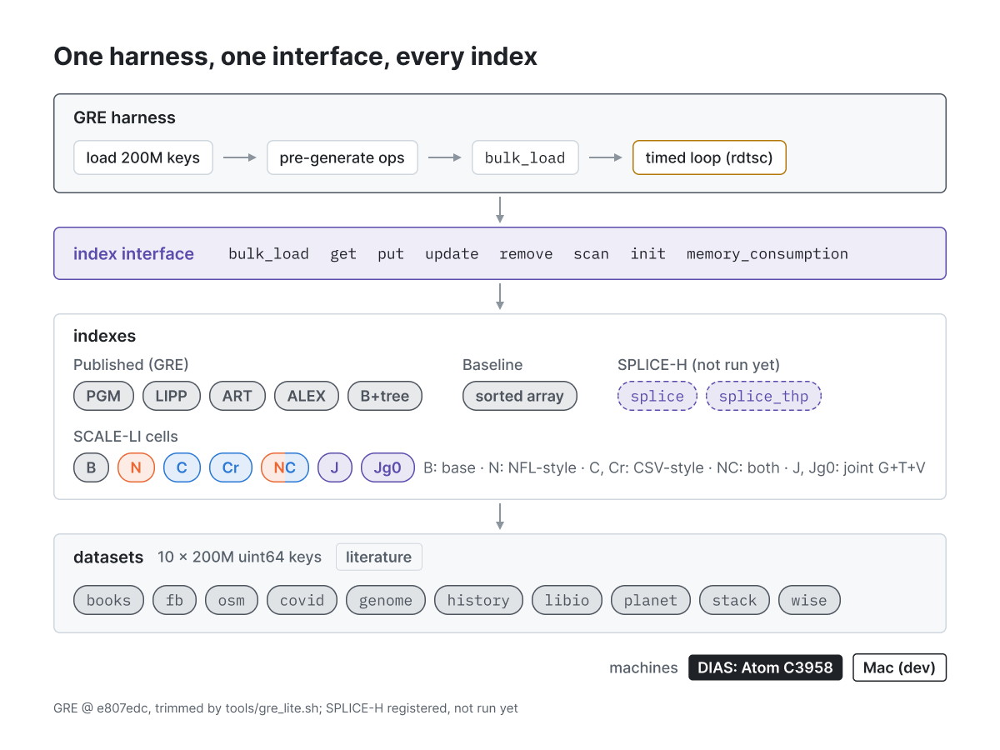

`F01_harness.png` (Figma node 7:155)

**Message:** every index, ours included, runs through the same trimmed GRE driver, the same index interface and the same ten 200M-key datasets.

- Same driver, same 200M-key files and same lookup stream for every index, ours included
- GRE trimmed to indexes that build without AVX2/MKL on the Atom (ALEX built with ALEX_USE_LZCNT 0)
- SCALE-LI cells and SPLICE enter through a C++17 facade over an opaque C++20 translation unit
- Read-only correctness check: success_read == operations_num for every run
- Next step: run splice and splice_thp; retire the scaleli_splice -> Jg0 alias (gre_lite.sh:141) *(updated: splice and splice_thp are already registered in the working-tree tools/gre_lite.sh, lines 143-144)*

### F02 · One timed run: 20M warm-up, then 100M timed lookups
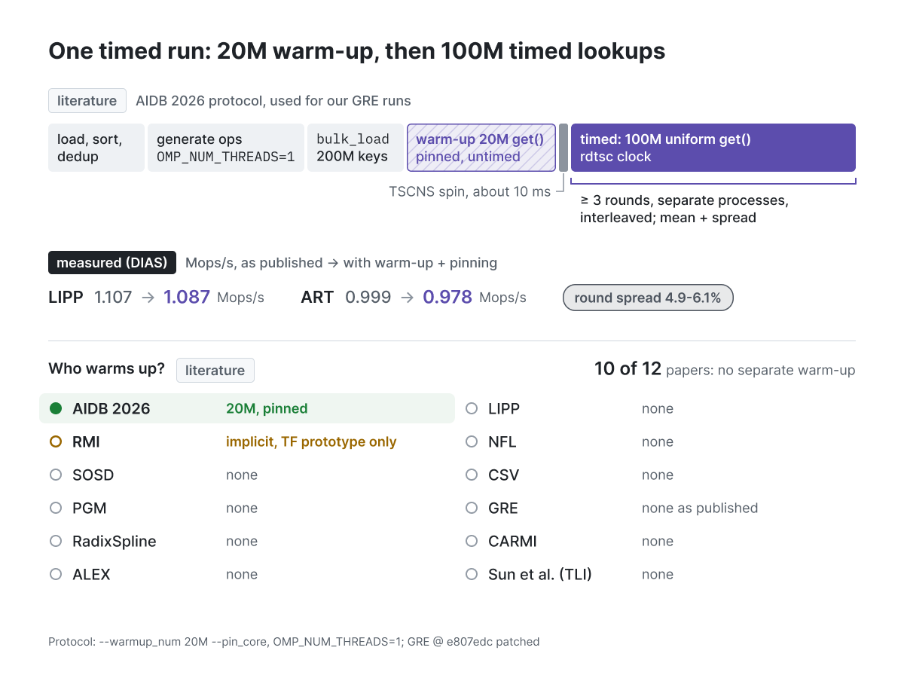

`F02_timed_run.png` (Figma node 6:7)

**Message:** our runs follow the AIDB 2026 protocol (20M pinned, untimed warm-up, then 100M timed lookups). 10 of 12 papers time from a cold start, and warm-up moves LIPP and ART by about 2%, inside the round spread.

- Protocol = AIDB 2026: 20M untimed warm-up, 100M timed uniform lookups, one pinned thread
- GRE, SOSD, PGM, ALEX, LIPP, NFL and the others time from a cold start (diluted over 10M-800M ops)
- OMP_NUM_THREADS=1 is mandatory: GRE seeds one RNG per OpenMP thread, so with T>1 the warm-up replays timed keys
- Warm-up and pinning shift LIPP and ART by about 2%, inside the 4.9-6.1% round spread
- Headline = warm 100M throughput; the cold-inclusive GRE-style run (W=0) is kept as a comparison arm

### F03 · Lookup cost = dependent DRAM accesses
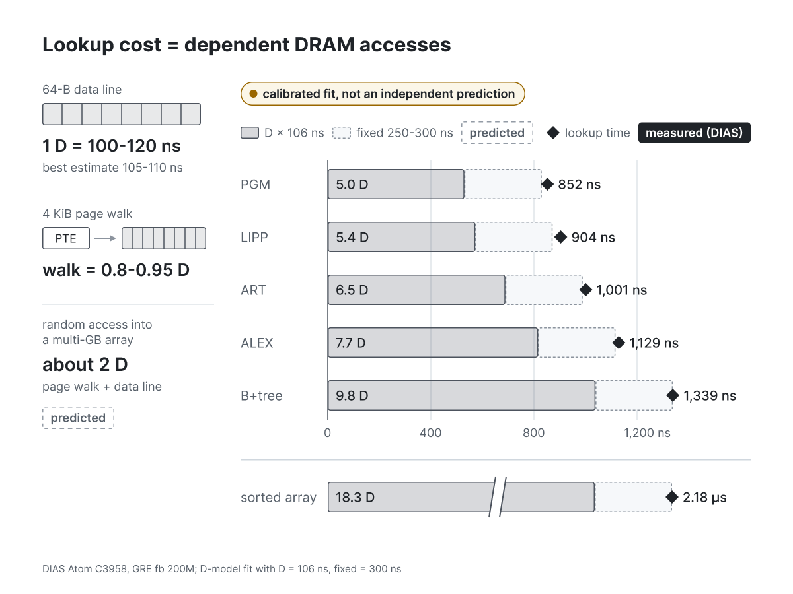

`F03_dram_cost.png` (Figma node 4:2)

**Message:** on the Atom, lookup time behaves like a count of dependent DRAM accesses. D x 106 ns plus a 300 ns fixed term reproduces all five published indexes, but this is a calibrated fit, not an independent prediction.

- Atom C3958: no L3, so every L2 miss goes straight to DRAM; 1 D is about 105 ns
- With 4 KiB pages a random access into GBs costs about 2 D: the page-table line misses too
- The same D explains all five published indexes within a few percent of measured ns
- Learned indexes win or lose by the number of dependent misses, not by model accuracy
- Caveat: D and the 250-300 ns fixed term are fitted to these numbers; perf counters must confirm

### F04 · Measured on DIAS: fb, 200M keys
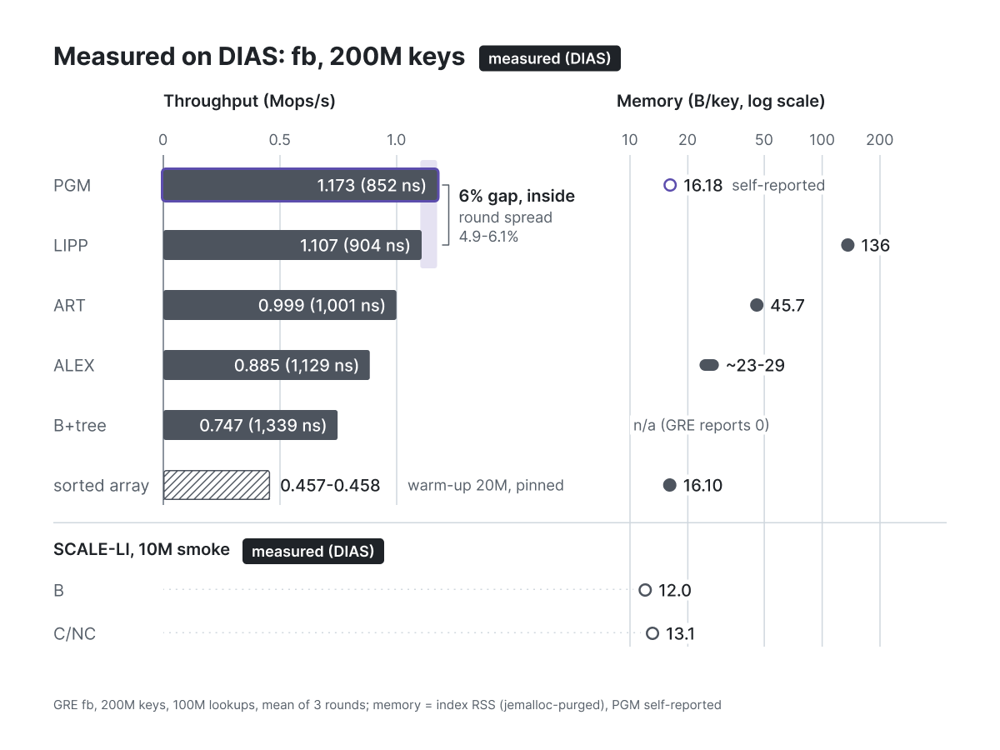

`F04_dias_fb.png` (Figma node 9:52)

**Message:** on fb at 200M keys, PGM and LIPP tie within the round spread; memory (16.18 vs 136 B/key) is what separates them.

- PGM 852 ns and LIPP 904 ns: the 6% gap is inside the 4.9-6.1% round spread
- Memory is the real separator: LIPP pays 136 B/key (about 8x PGM) for the same speed
- PGM is within 0.1 B/key of the sorted array: models cost about 0.18 B/key
- Sorted array (binary search) is 2.6x slower than PGM: about 18 dependent misses per lookup
- SCALE-LI packs to 12-13 B/key, but its lookup path is long (expected 0.3-0.45 Mops/s)

*Provenance (updated):* the SCALE-LI 10M smoke values (B 12.0 B/key, C/NC 13.1 B/key, build 3.7 s vs ~114 s) were measured on DIAS by Louis (GRE smoke test on the Atom). The tag now reads `measured (DIAS)`, not `measured (Mac)`.

### F05 · Most structure is fine-scale: 67-99% of log-gap variance
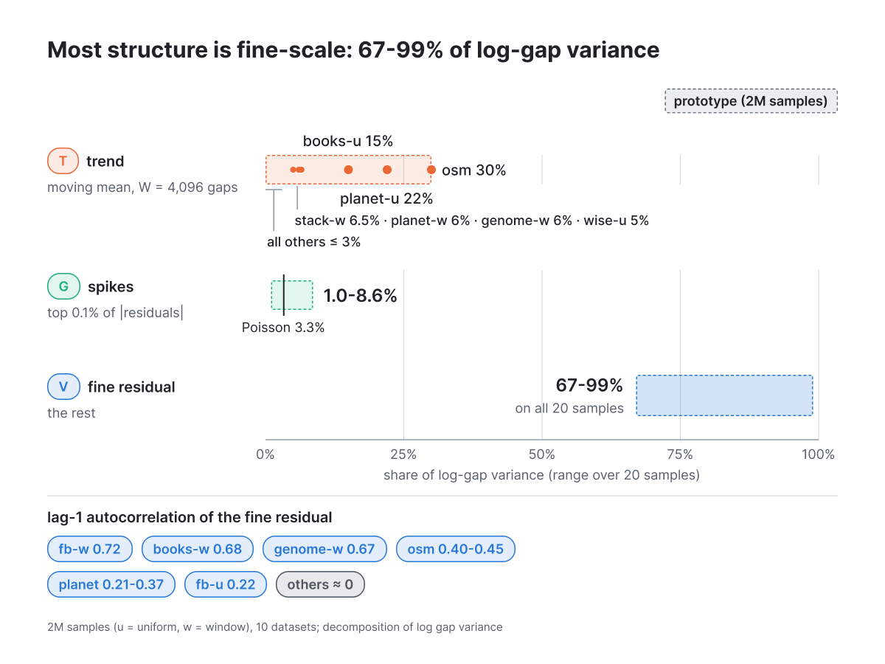

`F05_fine_scale.png` (Figma node 9:287)

**Message:** the fine residual carries 67-99% of log-gap variance on every sample, so the design lever is local slack, not a global warp.

- Decompose log(gap) into trend (W = 4,096-gap moving mean), spikes (top 0.1%) and fine residual
- Fine residual carries 67-99% of the variance on every sample: the lever is local slack, not a global warp
- Trend is real only on osm (30%), planet (22%) and books (15%)
- On hard data the fine part is clustering, not noise: lag-1 autocorrelation up to 0.72 (fb)
- Uniform 2M samples flatten this clustering; design decisions use windows or all 200M keys

### F06 · Three ways to buy fewer root probes
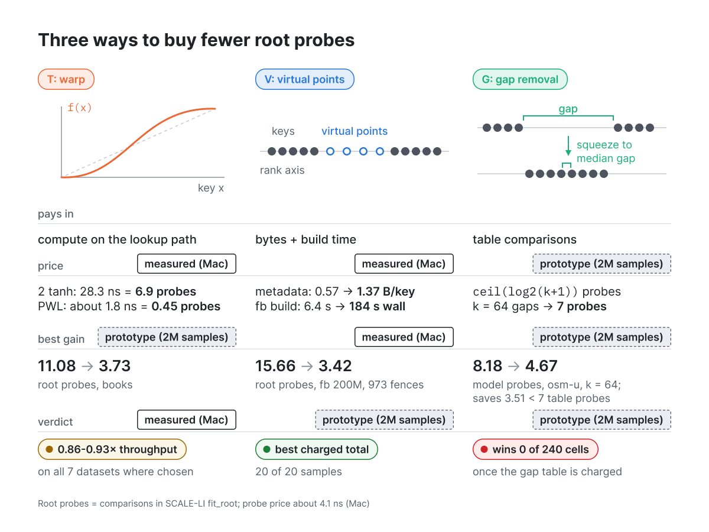

`F06_root_probes.png` (Figma node 9:224)

**Message:** T, V and G all cut root probes but pay in compute, bytes and build time, or table comparisons. Once that price is charged, V is the only consistent winner.

- All three blocks reduce root probes; they differ in what they charge
- T: a global warp is a real lever (books 11.08 -> 3.73) but costs 6.9 probe-equivalents per lookup as tanh
- V: virtual fences halve probes on fb at full scale, paid in bytes and a slow greedy build
- G: straightens osm the most, yet the gap table always costs more probes than it saves
- Charged honestly, V alone is the best single block on 20/20 samples

### F07 · At a linear model, a gap removed = virtual points added
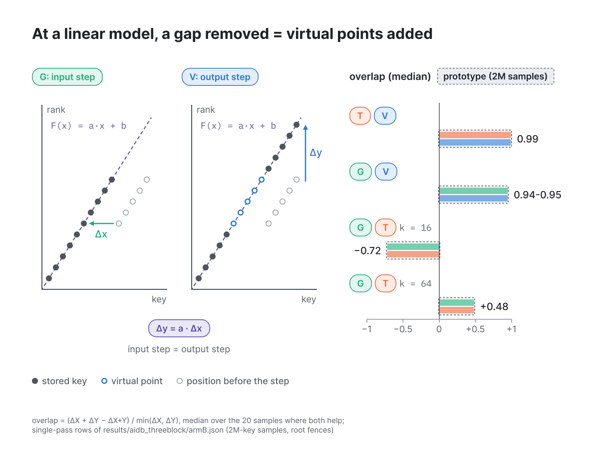

`F07_gap_equals_points.png` (Figma node 7:67)

**Message:** under a linear model, shrinking a gap by Δx is the same as inserting a·Δx virtual ranks, so G and V (and T and V) fix the same misfit (overlap 0.94-0.99).

- For F(x) = a x + b, shrinking a gap by Delta x equals inserting a * Delta x virtual ranks
- So G and V are one degree of freedom seen from two axes: their gains overlap at 0.94-0.95
- T and V overlap at 0.99: a warp and virtual points also fix the same misfit at the root
- G and T interact in sign-changing ways (-0.72 at k=16, +0.48 at k=64): T changes which gaps are largest
- Consequence: give each block a different scale instead of stacking them on the same one

*Source line (updated):* overlap = (ΔX + ΔY − ΔX+Y) / min(ΔX, ΔY), median over the 20 samples where both help; single-pass rows of results/aidb_threeblock/armB.json (2M-key samples, root fences).

### F08 · Error proxies mis-rank models; count the lines instead
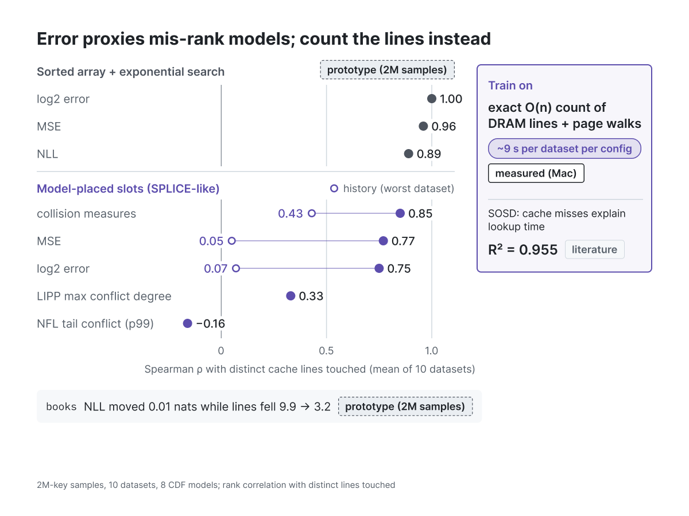

`F08_error_proxies.png` (Figma node 10:83)

**Message:** once keys are placed by the model, error proxies stop ranking models correctly (down to rho 0.05-0.07 on history), so the training objective is the exact count of DRAM lines and page walks.

- For a packed sorted array, log2 error ranks models exactly like the lines they touch (rho = 1.00)
- Once keys are placed by the model, error proxies drift: rho 0.75-0.77, and 0.05-0.07 on history
- LIPP's conflict degree (0.33) and NFL's tail conflict (-0.16) are poor guides for this layout
- SOSD: cache misses explain 95.5% of lookup time; log2 error adds nothing once misses are known
- So the objective is the exact count of dependent lines and page walks: about 9 s per configuration

### F09 · Every learned index is a learned hash: who pays for a collision
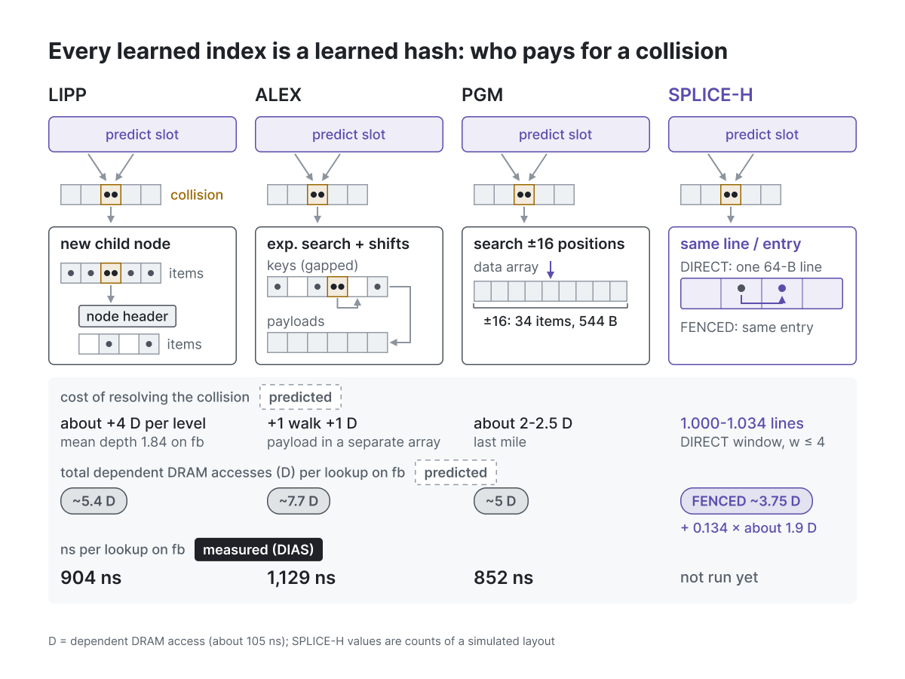

`F09_learned_hash.png` (Figma node 10:261)

**Message:** every learned index hashes a key to a slot; they differ in who pays for a collision, from about +4 D per LIPP level to SPLICE-H staying inside the line or entry it already loaded.

- slot = floor(S * F(x)) is an order-preserving learned hash; collision theory applies directly (Sabek et al.)
- LIPP resolves a collision with a child node: 2 more dependent misses per level, each with a page walk (about +4 D) *(corrected from "about 2 more dependent misses per level" to match the figure and the fact source)*
- ALEX shifts and searches, then reads the payload from a separate array (one more walk and line)
- PGM searches a +/-16 window: about 2-2.5 D of last mile
- SPLICE-H keeps collisions inside the line or entry it already loaded

### F10 · SPLICE-H: one lookup, tier by tier
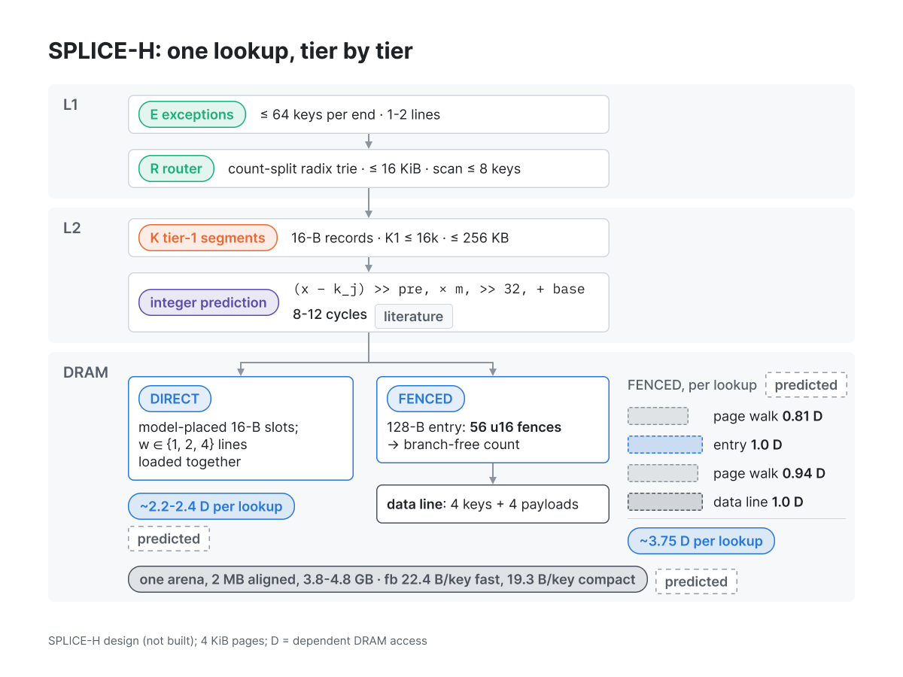

`F10_splice_lookup.png` (Figma node 10:158)

**Message:** a SPLICE-H lookup does integer-only, cache-resident work in L1 and L2, then touches DRAM about 2.2-2.4 D (DIRECT) or about 3.75 D (FENCED) per lookup.

- Above the data everything is integer-only and cache-resident: exceptions and router in L1, 16-B segment records in L2
- Each segment picks a mode: DIRECT (model-placed slots) or FENCED (128-B directory entry over data lines)
- FENCED counts all 56 fences without branching and lands on the exact data line
- No libm, no division, no floating point: bit-identical predictions on Mac and Atom
- One pre-touched arena, no per-node heap objects: no extra dependent miss for headers or payloads

### F11 · Which datasets get which mode
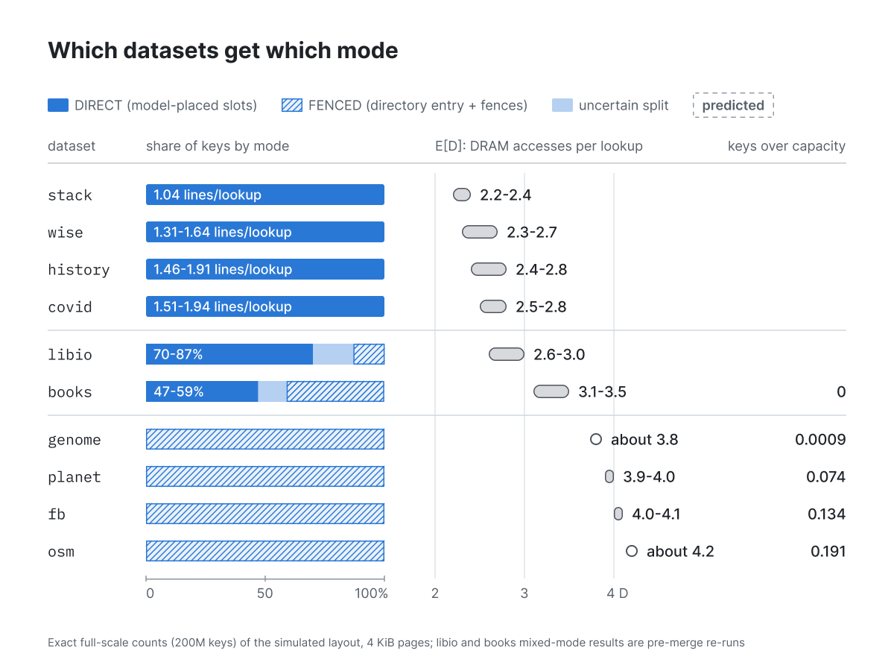

`F11_dataset_modes.png` (Figma node 8:51)

**Message:** mode is chosen per segment by the exact count. Easy data stays DIRECT at about 2.2-2.8 D, and clustered data (genome, planet, fb, osm) goes FENCED at about 3.8-4.2 D.

- Mode is chosen per segment by the exact count, not per dataset by hand
- Easy data (stack, wise, history, covid) stays DIRECT at 1.04-1.94 lines per lookup
- Clustered data (genome, planet, fb, osm) goes FENCED: about 3.8-4.2 D per lookup
- libio and books mix both modes; their numbers predate the merged design
- PGM's last level fits cache on the five easy datasets, so margins there will be smallest (stack 0.87 MB)

### F12 · G, T, V: three scales, one owner each
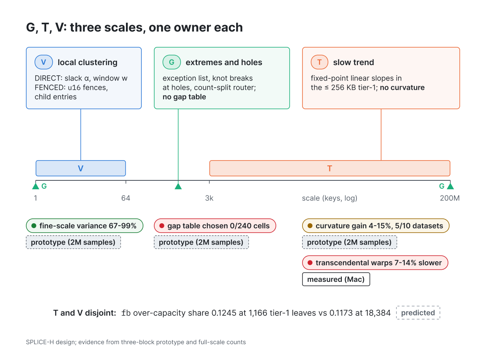

`F12_gtv_scales.png` (Figma node 11:168)

**Message:** each block owns one scale: V owns 1-64-key clustering, T owns the trend above about 3k keys, and G owns the extremes and holes.

- V owns 1-64-key clustering: slack and window (DIRECT) or fences and child entries (FENCED)
- T owns the slow trend above about 3k keys: linear segments only; curvature and tanh did not pay
- G owns extremes and holes: 21 fb outliers in an exception list, knot breaks at holes, no gap table
- Evidence of disjoint scales: changing tier-1 resolution 16x leaves the over-capacity share unchanged
- No G/T/V alternation: it bought at most 0.072 probes for about 2,000 s per round

*Provenance (checked):* "transcendental warps 7-14% slower" stays `measured (Mac)`. It comes from results/aidb_jointrun (summary.json speedups 0.862-0.934 on the 7 datasets that chose the flow+fences root; environment.json: macOS 15.7.5, arm64, Apple clang; 2M samples, 3 seeds), cited in splice_synthesis.md (T row) and splice_design_full.json. *Provenance (updated):* the fb over-capacity shares (0.1245 at 1,166 tier-1 leaves vs 0.1173 at 18,384) are exact full-scale counts of the simulated layout (computed on the Mac, not timed), so they keep the `predicted` tag, as in the legend and as F11 tags fb's 0.134.

### F13 · fb budget: SPLICE-H 454-670 ns vs PGM 852 ns
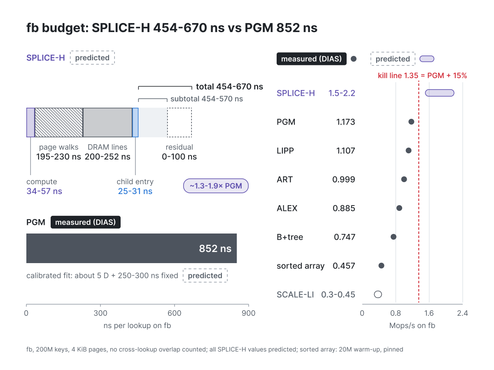

`F13_fb_budget.png` (Figma node 11:378)

**Message:** the fb budget predicts SPLICE-H at 454-670 ns (1.5-2.2 Mops/s), against PGM's measured 852 ns. Below 1.35 Mops/s the claim is dropped.

- Budget on fb: 2 page walks + 2 DRAM line loads + about 35-60 ns of compute + a 0.134 spill
- Predicted 454-670 ns (1.5-2.2 Mops/s) vs PGM measured 852 ns: about 1.3-1.9x
- Fails only if D is about 170 ns and the unexplained residual is about 250 ns at the same time
- Not counted: up to about 0.9 D of cross-lookup overlap; THP would cut both walks to 10-30 ns
- Kill line: below 1.35 Mops/s on 4 KiB pages, the read-only claim is dropped

### F14 · What confirms or kills SPLICE-H
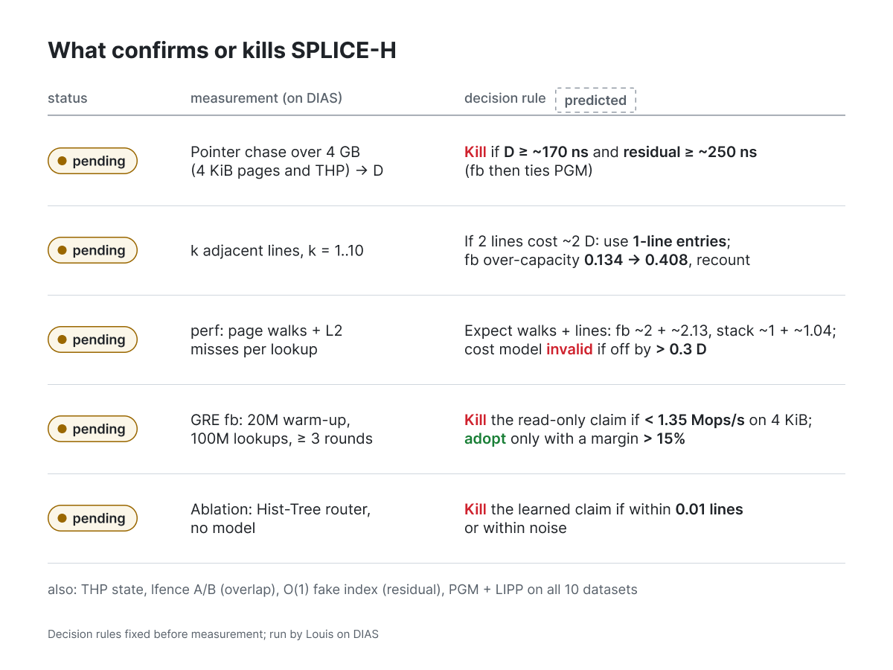

`F14_kill_criteria.png` (Figma node 11:108)

**Message:** five pending measurements on DIAS confirm or kill SPLICE-H, and each decision rule was fixed before measuring.

- Calibrate first: D, multi-line cost and page-walk cost on the Atom, before any SPLICE code is timed
- Counters must match the count model within 0.3 D, otherwise the cost model is wrong
- Headline test: fb in GRE, 20M warm-up, 100M lookups, >= 3 rounds; kill below 1.35 Mops/s
- Adopt only with a margin above 15% (the round spread is 4.9-6.1%)
- The Hist-Tree router ablation decides whether any learned part earns its place

To record a result, swap the row's status chip in Figma from `WARN` "pending" to `PASS` or `FAIL` and set its label, then re-export the PNG.

## Open items before the meeting

1. **F11:** the libio and books rows are pre-merge counts. Update them in place once the merged splice_count output lands.
2. **F09:** ALEX's "cost of resolving the collision" cell shows only the payload read (+1 walk +1 D). The analysis also charges about 1 D for the exponential-search lines. The ~7.7 D total is correct.
3. **F06 bullet 2:** the bullet says V "halves" probes on fb, but the figure shows 15.66 -> 3.42 root probes, about 4.6x fewer. Reword the bullet, or say what the halving refers to.
4. **F14:** the rule text uses "~" outside chips (for example "D ≥ ~170 ns"). This is left as is so the rows stay on two lines.

Resolved in the 2026-10-06 pass: F04 smoke machine (DIAS), F12 warp source (Mac, kept) and over-capacity tag (kept `predicted`: simulated layout count), F07 overlap definition and source, provenance tags at 18 px, and text styles bound file-wide.
